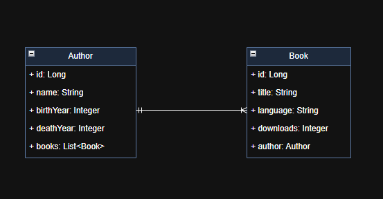

# LiterAlura: Catálogo de Livros

O **LiterAlura** é um projeto de catálogo de livros, desenvolvido como parte de um desafio do programa **Oracle One Next Education**, juntamente com **Alura**. O objetivo é criar uma aplicação que interaja com os usuários via console, permitindo que eles:

- Pesquisem livros e autores;
- Visualizem livros registrados;
- Acessem informações sobre os livros mais baixados;
- E mais...


## Funcionalidades

- 🔍 Buscar livros pelo título usando a API da **Gutendex**.
- 📚 Listar livros registrados no banco de dados.
- ✍️ Listar autores registrados no banco de dados.
- 🧓 Pesquisar autores vivos em um determinado ano.
- 🌍 Filtrar livros por idioma.
- 📈 Exibir os livros mais baixados.
- 👤 Pesquisar autores por nome.

## Tecnologias Utilizadas

- ☕ **Java 21**
- ⚙️ **Spring Boot** (Framework principal)
- 🗃️ **Spring JPA / Hibernate** (Para persistência de dados)
- 🐘 **PostgreSQL** (Banco de dados relacional)
- 🌐 **API Gutendex** (Para obter informações sobre livros)
- 🐳 **Docker** (Para ambiente de banco de dados)
---

## Ao iniciar a aplicação será exibido o seguinte menu no terminal:

```
=================================================
               CATÁLOGO LITERALURA
=================================================

1 - Buscar livro pelo título (via Gutendex API)
2 - Listar livros registrados
3 - Listar autores registrados
4 - Listar autores vivos em determinado ano
5 - Listar livros de determinado idioma
6 - Listar Top livros mais baixados
7 - Pesquisar por autores registrados

0 - Sair

=================================================
Digite uma opção:

```

## Exemplo de Uso

- **Buscar um livro pelo título**:  
  O usuário insere o título de um livro e o sistema tenta encontrar esse livro na API **Gutendex**, exibindo detalhes como autor, idioma e número de downloads.

- **Listar livros registrados**:  
  Exibe todos os livros que foram previamente registrados no banco de dados.

- **Autores registrados**:  
  Lista todos os autores que têm livros registrados na aplicação.

- **Pesquisar autores vivos em determinado ano**:  
  Permite que o usuário insira um ano e veja quais autores estavam vivos naquele ano.

- **Listar livros por idioma**:  
  Filtra e exibe os livros de um determinado idioma.

- **Top livros mais baixados**:  
  Exibe os livros mais baixados, com base no número de downloads.

---

## Diagrama de Classes

- Com apenas duas entidades relacionadas para o funcionamento do sistema, temos a seguinte representação:



---

## Estrutura do Código

O código está organizado da seguinte maneira:

- **`model/`**: Contém as classes de modelo de dados, como `Author` e `Book`.
- **`repository/`**: Contém as interfaces para interagir com o banco de dados.
- **`service/`**: Contém as classes de serviço, que implementam a lógica de negócios.
- **`principal/`**: Contém a classe que gerencia a interação com o usuário via console.
- **`dtos/`**: Contém os objetos de transferência de dados (DTOs) para comunicação com a API **Gutendex**.
---

## Badge de Entrega do Desafio


---